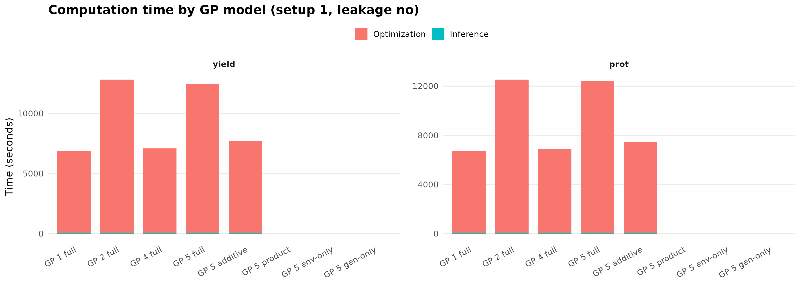
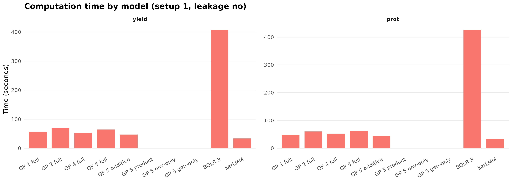
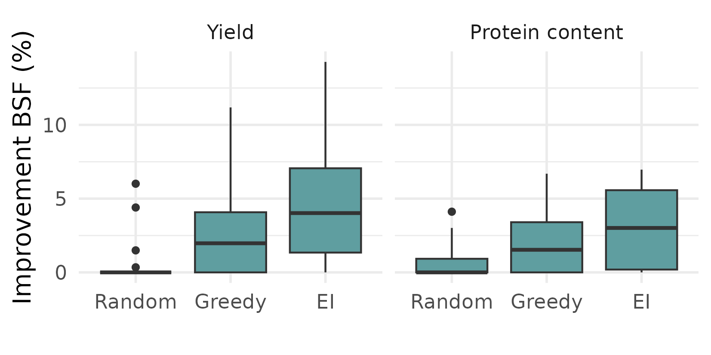

# Gaussian Process Experiments for Yield and Protein

This repository implements the full experimental pipeline used in our paper for Gaussian Process (GP) prediction of **yield** and **protein content** from environmental and genomic wheat data.
Below is an end‑to‑end description of what happens when you run the GP prediction through the code GP.R in the folder 'GP_modeling'.

-----------------------------------------------------------------------
## 0) Entry points

### Local entry point
Run everything from R via:


    source("GP_modeling/GP.R")

### Cluster entry point
On an HPC use:

    Batch_files_cluster/Run_experiments1.sh

This submits `GP.R` as a SLURM job array.

-----------------------------------------------------------------------
## 1) What `Start.R` does (environment setup)

`Start.R` loads **all required packages** and standardizes the computational environment:

Key libraries include:
- nloptr, MASS, Matrix          (optimization, linear algebra)
- kernlab, rrBLUP               (kernels and genomics tools)
- scoringRules                  (CRPS, LogS)
- foreach, doParallel           (parallel execution)
- tidyverse, dplyr, tibble      (data handling)
- progress                      (progress bars)


-----------------------------------------------------------------------
## 2) Train–test splits and hyperparameter precomputation (`Initial_params.R`)

`GP_modeling/Functions/Initial_params.R` performs **all reproducibility-critical preprocessing**.

For each split index

    id ∈ {1,…,30}

it:
1. Sets `set.seed(id)`.
2. Creates an **80/20 train–test split** via `select_train_ind()`.
3. Runs a **Latin hypercube grid search (100 points)** over kernel hyperparameters.
4. Evaluates the **marginal likelihood** at each point.
5. Saves:
   - the best initial hyperparameters, and  
   - the exact train/test indices for this `id`.

These objects are later loaded automatically by `GP.R` so that every experiment is exactly reproducible.

-----------------------------------------------------------------------
## 3) Main experiment driver (`GP.R`)

`GP_modeling/GP.R` runs the whole experiment.

### Environment variables controlling the run

You can control the setup via SLURM or on your local:

| Variable      | Meaning |
|---------------|---------|
| SLURM_ARRAY_TASK_ID | split index `id` (default 1) |
| KERNEL        | kernel choice (default 5) |
| ADDONLY       | 1 = additive kernel only |
| PRODONLY      | 1 = product kernel only |
| LONG_ADAM     | 1 = longer Adam schedule |
| GA_KERNEL     | use Global alignment as environment kernel |
| NLOPTR        | 1 = use L-BFGS-B instead of Adam |

### Default behavior

By default (`id=1`, `KERNEL=5`), `GP.R` uses the **full kernel**

    K = w1(1−w2) K_env + w1 w2 K_gen + (1−w1)(K_env ⊙ K_gen)

with `⊙` the elementwise (Hadamard) product.

-----------------------------------------------------------------------
## 4) Noise model and parameterization

The training covariance is modeled as

$$
K_{\text{obs}} = \sigma^2 K + \tau^2 I_n .
$$

Rather than optimizing $(\sigma^2,\tau^2)$ separately, we reparameterize via

$$
\nu = \sigma^2 + \tau^2, \qquad
\zeta = \frac{\sigma^2}{\sigma^2 + \tau^2}.
$$

This lets us write

$$
K_{\text{obs}} = \nu K_\zeta, \qquad
K_\zeta = \zeta K + (1-\zeta) I_n .
$$

In the code, the parameter $\zeta$ is called `alpha`.

For a fixed value of $\zeta$, the optimal scale parameter $\nu$ has a closed-form solution.  
Let $y \in \mathbb{R}^n$ be the training targets and $\mathbf{1}$ the vector of ones.  
Define

$$
\hat\beta =
\frac{\mathbf{1}^\top K_\zeta^{-1} y}
     {\mathbf{1}^\top K_\zeta^{-1} \mathbf{1}} .
$$

Then

$$
\hat\nu =
\frac{1}{n}
(y-\hat\beta \mathbf{1})^\top
K_\zeta^{-1}
(y-\hat\beta \mathbf{1}).
$$

Consequently, in the **full noisy model** we optimize five parameters:

$$
(\theta_1, \theta_2, w_1, w_2, \zeta).
$$

In the paper, we denote 6 parameters, to write the covariance as 

$$
K = \alpha K_{\text{gen}} + \beta K_{\text{env}} + \gamma(K_{\text{env}} ⊙ K_{\text{gen}})
$$

with $$\alpha=w_1(1-w_2),$$ $$\beta=w_1w_2,$$ and $$\gamma=1-w_1.$$ This allows to parametrize the three weights $$\alpha, \beta, \gamma \in [0,1],$$ $$\alpha+\beta+\gamma=1$$ using $$w_1,w_2\in [0,1].$$

-----------------------------------------------------------------------
## 5) Core GP machinery (`Functions/GP_functions.R`)

`GP_modeling/Functions/GP_functions.R` contains:

- construction of genomic and environmental kernels,
- cross-covariances between train and test,
- log marginal likelihood + analytical gradients,
- `GP_test()`  → posterior predictive mean & variance,
- `LogS()`     → log score,
- `CRPS()`     → Continuous ranked probability score.


-----------------------------------------------------------------------
## 6) Training loop (`Functions/GP_training.R`)

For each setting, `GP_training.R`:

1. Loads the precomputed split and initial parameters.
2. Builds the chosen kernel (full/additive/product).
3. Runs gradient-based optimization:
   - **Default:** Adam (lr = 0.01, 1000 iterations).
   - **If NLOPTR=1:** L-BFGS-B via `nloptr`.
4. Recomputes the posterior GP.
5. Evaluates predictive performance on the test set.

-----------------------------------------------------------------------
## 7) The 8 experimental settings

`GP.R` runs **8 settings in parallel**, combining:

- Target: **yield** vs **protein**
- Leakage: **yes** vs **no**
- Prediction task:
  - new environment, or  
  - new variety.

Each of the 8 settings is trained independently but shares the same split `id`.

-----------------------------------------------------------------------
## 8) Outputs

For each of the 8 settings, `GP.R` saves one `.rda` file containing a `1 × 23` matrix `res` that come from the 6) `Functions/GP_training.R` with:

| Index      | Quantity |
|------------|----------|
| [1]        | MSE |
| [2]        | CRPS |
| [3–4]      | Global averages: MSE, MAE |
| [5–6]      | Variety averages: MSE, MAE |
| [7–8]      | Environmental averages: MSE, MAE |
| [9]        | Optimized training likelihood |
| [10]       | Log score (average) |
| [11]       | Log score (joint) |
| [12]       | Likelihood at Latin hypercube optimum |
| [13–17]    | Gradient-based optimized kernel parameters |
| [19–23]    | Initial parameters (Latin hypercube optimum) |

### File naming convention (GP results)

All GP results are saved using the structure:

```
Results[_additive_only|_product_only]/
├── Results Adam/
│   └── Results_hyper_ADAM_<lr>_<max_iter>_<batchsize>_<target><kernel><leakage><setup>_<run_id>.rda
└── Results LBFGS/
    └── Results_hyper_<NLOPT_alg>_<batchsize>_<target><kernel><leakage><setup>_<run_id>.rda
```

**Components**

| Component | Meaning |
|-----------|---------|
| `<target>` | `yield` or `prot` |
| `<kernel>` | Kernel index (1–5) |
| `<leakage>` | `yes` or `no` |
| `<setup>` | Experimental setup (1 or 2) |
| `<run_id>` | Repetition index (1–30) |
| `<lr>` | Adam learning rate |
| `<max_iter>` | Adam iterations |
| `<batchsize>` | Minibatch fraction |

**Example**

```
Results/Results_additive_only/Results Adam/
Results_hyper_ADAM_0.01_1000_0.5_yield5yes1_1.rda
```

---

### File naming convention (LMM and BGLR)

```
Results[_additive_only|_product_only]/
├── Results LMM/
│   └── Results_LMM<model>_<target><kernel><leakage><setup>_<run_id>.rda
└── Results BGLR/
    └── Results_hyper_ADAM_<lr>_<max_iter>_<model>_<target><kernel><leakage><setup>_<run_id>.rda
```

Remember that the BGLR filenames include the optimizer name, as we use the optimized kernel parameters from the GP training.
We only analysed these models with the default Adam-optimized parameters.

### Console output

`GP.R` also prints a concise summary of all eight settings to the console.  
For example, for kernel 5, run id 1:

```r
Saved results under:  Results/Results_additive_only/Results Adam/Results_hyper_ADAM_0.01_1000_0.5_yield5yes1_1.rda
Saved results under:  Results/Results_additive_only/Results Adam/Results_hyper_ADAM_0.01_1000_0.5_prot5yes1_1.rda
Saved results under:  Results/Results_additive_only/Results Adam/Results_hyper_ADAM_0.01_1000_0.5_yield5no1_1.rda
Saved results under:  Results/Results_additive_only/Results Adam/Results_hyper_ADAM_0.01_1000_0.5_prot5no1_1.rda
Saved results under:  Results/Results_additive_only/Results Adam/Results_hyper_ADAM_0.01_1000_0.5_yield5yes2_1.rda
Saved results under:  Results/Results_additive_only/Results Adam/Results_hyper_ADAM_0.01_1000_0.5_prot5yes2_1.rda
Saved results under:  Results/Results_additive_only/Results Adam/Results_hyper_ADAM_0.01_1000_0.5_yield5no2_1.rda
Saved results under:  Results/Results_additive_only/Results Adam/Results_hyper_ADAM_0.01_1000_0.5_prot5no2_1.rda


==================== GP RUN ====================
Kernel setup: additive_only | Kernel: 5 | optimizer: Adam (lr=0.01, iters=1000) | batchsize: 0.5
------------------------------------------------

[target=yield | leakage=yes | setup=1 | lr=0.01]
  MSE  = 35.051706
  CRPS = 3.328541
  LogS = 3.252835
Initial parameters chosen by grid search: [0.823691, 0.509843, 0.810473, 0.921577]
Optimized parameters : [0.190601, 2.05498, 0.514564, 0.900018]

[target=prot | leakage=yes | setup=1 | lr=0.01]
  MSE  = 0.565203
  CRPS = 0.422921
  LogS = 1.311950
Initial parameters chosen by grid search: [0.823691, 0.509843, 0.810473, 0.921577]
Optimized parameters : [0.207293, 1.85472, 0.474714, 0.90632]

[target=yield | leakage=no | setup=1 | lr=0.01]
  MSE  = 119.311124
  CRPS = 5.748746
  LogS = 3.856196
Initial parameters chosen by grid search: [0.214214, 0.293466, 0.503895, 0.878264]
Optimized parameters : [0.189298, 1.91131, 0.530486, 0.897741]

[target=prot | leakage=no | setup=1 | lr=0.01]
  MSE  = 1.563947
  CRPS = 0.692426
  LogS = 1.726548
Initial parameters chosen by grid search: [0.214214, 0.293466, 0.503895, 0.878264]
Optimized parameters : [0.213075, 1.72074, 0.485265, 0.903016]

[target=yield | leakage=yes | setup=2 | lr=0.01]
  MSE  = 29.843092
  CRPS = 3.004402
  LogS = 3.262188
Initial parameters chosen by grid search: [0.37381, 0.303285, 0.761763, 0.884025]
Optimized parameters : [0.185758, 1.92616, 0.540252, 0.895275]

[target=prot | leakage=yes | setup=2 | lr=0.01]
  MSE  = 0.406461
  CRPS = 0.361664
  LogS = 1.125647
Initial parameters chosen by grid search: [0.37381, 0.303285, 0.761763, 0.884025]
Optimized parameters : [0.206755, 1.6675, 0.483441, 0.90671]

[target=yield | leakage=no | setup=2 | lr=0.01]
  MSE  = 33.285013
  CRPS = 3.144164
  LogS = 3.183940
Initial parameters chosen by grid search: [0.159907, 0.748495, 0.674144, 0.886512]
Optimized parameters : [0.186266, 2.03291, 0.520279, 0.8984]

[target=prot | leakage=no | setup=2 | lr=0.01]
  MSE  = 0.677988
  CRPS = 0.471084
  LogS = 1.357033
Initial parameters chosen by grid search: [0.159907, 0.748495, 0.674144, 0.886512]
Optimized parameters : [0.206976, 1.82256, 0.467719, 0.909416]

================================================
```


-----------------------------------------------------------------------

# Result tables 

The result tables can be produced by running the code `Results/Result_tables.R`, which creates the md files `README_table_setup1.md` and `README_table_setup2.md`. Parentheses indicate scores of GP model with nugget.

## Setup 1: New Environment

Method | MSE Y | CRPS Y | logS Y | MSE P | CRPS P | logS P
--- | --- | --- | --- | --- | --- | ---
GP⁓₁ | 127.97 \| 43.33<br>(127.95 \| 43.33) | 6.33 \| 3.67<br>(6.44 \| 3.82) | 3.88 \| 3.34<br>(3.90 \| 3.41) | 1.54 \| 0.56<br>(1.54 \| 0.56) | 0.69 \| 0.42<br>(0.70 \| 0.44) | 1.64 \| 1.18<br>(1.69 \| 1.23)
GP⁓₂ | 128.22 \| 41.83<br>(128.15 \| 41.95) | 6.35 \| 3.58<br>(6.45 \| 3.77) | 3.88 \| 3.31<br>(3.90 \| 3.40) | 1.54 \| 0.57<br>(1.54 \| 0.57) | 0.69 \| 0.43<br>(0.70 \| 0.44) | 1.63 \| 1.19<br>(1.69 \| 1.23)
GP⁓₄ | 119.72 \| 41.14<br>(119.72 \| 41.16) | 6.09 \| 3.55<br>(6.22 \| 3.73) | 3.83 \| 3.30<br>(3.87 \| 3.39) | 1.43 \| 0.55<br>(1.43 \| 0.55) | 0.67 \| 0.42<br>(0.68 \| 0.43) | 1.60 \| 1.17<br>(1.65 \| 1.22)
GP⁓₅ | 119.77 \| 41.14<br>(119.73 \| 41.13) | 6.09 \| 3.55<br>(6.22 \| 3.73) | 3.83 \| 3.29<br>(3.87 \| 3.39) | 1.43 \| 0.55<br>(1.43 \| 0.55) | 0.67 \| 0.42<br>(0.68 \| 0.43) | 1.60 \| 1.16<br>(1.65 \| 1.22)
GP⁺₅ | 124.92 \| 45.71<br>(125.25 \| 45.71) | 6.21 \| 3.78<br>(6.44 \| 3.91) | 3.85 \| 3.50<br>(3.91 \| 3.44) | 1.45 \| 0.58<br>(1.44 \| 0.58) | 0.68 \| 0.44<br>(0.69 \| 0.45) | 1.62 \| 1.35<br>(1.68 \| 1.25)
GP×₅ | 119.83 \| 42.57<br>(119.84 \| 42.55) | 6.11 \| 3.64<br>(6.14 \| 3.78) | 3.88 \| 3.31<br>(3.84 \| 3.38) | 1.48 \| 0.58<br>(1.48 \| 0.58) | 0.69 \| 0.43<br>(0.68 \| 0.44) | 1.66 \| 1.17<br>(1.62 \| 1.22)
GPᴳ₅ | 147.22 \| 147.76<br>(147.22 \| 147.76) | 8.65 \| 8.69<br>(6.87 \| 6.90) | 32.91 \| 33.47<br>(3.94 \| 3.94) | 1.72 \| 1.73<br>(1.72 \| 1.73) | 0.96 \| 0.95<br>(0.75 \| 0.75) | 28.74 \| 29.00<br>(1.71 \| 1.71)
GPᴱ₅ | 160.18 \| 83.91<br>(160.06 \| 83.91) | 7.14 \| 5.36<br>(7.33 \| 5.36) | 4.03 \| 3.93<br>(4.04 \| 3.74) | 2.07 \| 1.44<br>(2.07 \| 1.44) | 0.82 \| 0.71<br>(0.84 \| 0.70) | 1.89 \| 2.07<br>(1.89 \| 1.69)
BGLR⁓₅ | 123.20 \| 41.21 | 6.15 \| 3.55 | 3.83 \| 3.31 | 1.43 \| 0.56 | 0.68 \| 0.42 | 1.61 \| 1.18
kerLMM⁓₅ | 119.73 \| 41.00 | 8.47 \| 4.95 | — \| — | 1.43 \| 0.55 | 0.95 \| 0.58 | — \| —
GLO_A | 177.91 \| 177.75 | 10.48 \| 10.45 | — \| — | 2.34 \| 2.35 | 1.21 \| 1.21 | — \| —
VAR_A | 148.19 \| 148.28 | 9.62 \| 9.63 | — \| — | 1.71 \| 1.71 | 1.06 \| 1.06 | — \| —
ENV_A | — \| 96.58 | — \| 7.62 | — \| — | — \| 1.81 | — \| 1.06 | — \| —


## Setup 2: New Variety

Method | MSE Y | CRPS Y | logS Y | MSE P | CRPS P | logS P
--- | --- | --- | --- | --- | --- | ---
GP⁓₁ | 51.32 \| 38.97<br>(51.32 \| 39.01) | 3.98 \| 3.46<br>(4.07 \| 3.61) | 3.42 \| 3.30<br>(3.45 \| 3.35) | 0.65 \| 0.48<br>(0.65 \| 0.48) | 0.45 \| 0.39<br>(0.47 \| 0.41) | 1.23 \| 1.10<br>(1.31 \| 1.16)
GP⁓₂ | 52.42 \| 39.48<br>(52.35 \| 39.25) | 4.01 \| 3.47<br>(4.09 \| 3.62) | 3.42 \| 3.28<br>(3.46 \| 3.35) | 0.65 \| 0.48<br>(0.65 \| 0.48) | 0.46 \| 0.39<br>(0.47 \| 0.41) | 1.22 \| 1.08<br>(1.31 \| 1.16)
GP⁓₄ | 52.53 \| 38.99<br>(52.43 \| 39.10) | 4.02 \| 3.45<br>(4.11 \| 3.61) | 3.42 \| 3.30<br>(3.46 \| 3.35) | 0.66 \| 0.49<br>(0.66 \| 0.49) | 0.45 \| 0.39<br>(0.47 \| 0.41) | 1.22 \| 1.10<br>(1.31 \| 1.16)
GP⁓₅ | 51.50 \| 38.94<br>(51.50 \| 38.97) | 4.02 \| 3.45<br>(4.10 \| 3.62) | 3.41 \| 3.29<br>(3.46 \| 3.35) | 0.66 \| 0.49<br>(0.66 \| 0.49) | 0.46 \| 0.39<br>(0.47 \| 0.41) | 1.22 \| 1.09<br>(1.31 \| 1.16)
GP⁺₅ | 53.56 \| 39.95<br>(53.55 \| 39.93) | 4.14 \| 3.61<br>(4.19 \| 3.65) | 3.61 \| 3.72<br>(3.48 \| 3.37) | 0.67 \| 0.51<br>(0.67 \| 0.51) | 0.46 \| 0.41<br>(0.48 \| 0.41) | 1.36 \| 1.33<br>(1.33 \| 1.18)
GP×₅ | 50.52 \| 41.44<br>(50.53 \| 41.45) | 3.91 \| 3.54<br>(4.00 \| 3.68) | 3.40 \| 3.27<br>(3.41 \| 3.35) | 0.67 \| 0.50<br>(0.67 \| 0.50) | 0.46 \| 0.40<br>(0.47 \| 0.41) | 1.22 \| 1.09<br>(1.29 \| 1.18)
GPᴳ₅ | 162.32 \| 160.35<br>(162.32 \| 160.36) | 7.91 \| 7.93<br>(7.34 \| 7.27) | 5.74 \| 6.15<br>(4.04 \| 4.02) | 2.10 \| 1.97<br>(2.10 \| 1.97) | 0.89 \| 0.89<br>(0.84 \| 0.82) | 2.94 \| 3.18<br>(1.88 \| 1.84)
GPᴱ₅ | 53.62 \| 53.51<br>(53.80 \| 53.51) | 4.78 \| 4.76<br>(4.17 \| 4.15) | 7.81 \| 7.88<br>(3.47 \| 3.47) | 0.98 \| 0.96<br>(0.96 \| 0.96) | 0.65 \| 0.65<br>(0.57 \| 0.56) | 6.45 \| 6.46<br>(1.45 \| 1.45)
BGLR⁓₅ | 54.60 \| 39.15 | 4.09 \| 3.48 | 3.45 \| 3.31 | 0.66 \| 0.48 | 0.45 \| 0.39 | 1.21 \| 1.11
kerLMM⁓₅ | 51.55 \| 38.83 | 5.59 \| 4.81 | — \| — | 0.66 \| 0.49 | 0.65 \| 0.55 | — \| —
GLO_A | 177.71 \| 177.77 | 10.48 \| 10.49 | — \| — | 2.40 \| 2.40 | 1.25 \| 1.25 | — \| —
VAR_A | — \| 257.13 | — \| 12.57 | — \| — | — \| 3.07 | — \| 1.41 | — \| —
ENV_A | 53.73 \| 53.20 | 5.76 \| 5.76 | — \| — | 0.94 \| 0.94 | 0.77 \| 0.77 | — \| —


# Kernel Hyperparameters

The boxplot `Boxplots/Optimized_parameters_tar.png` can be produced by running the code `Results/Boxplots_kernel_parameters.R`.

## Optimized parameters for yield, setup 1, no leakage


## Optimized parameters for protein, setup 1, no leakage


## Optimized parameters for yield, setup 1, with leakage


## Optimized parameters for protein, setup 1, with leakage


# Model computation times

GP computation times include parameter optimization:


GP computation times include inference time only:




# Bayesian optimization results




